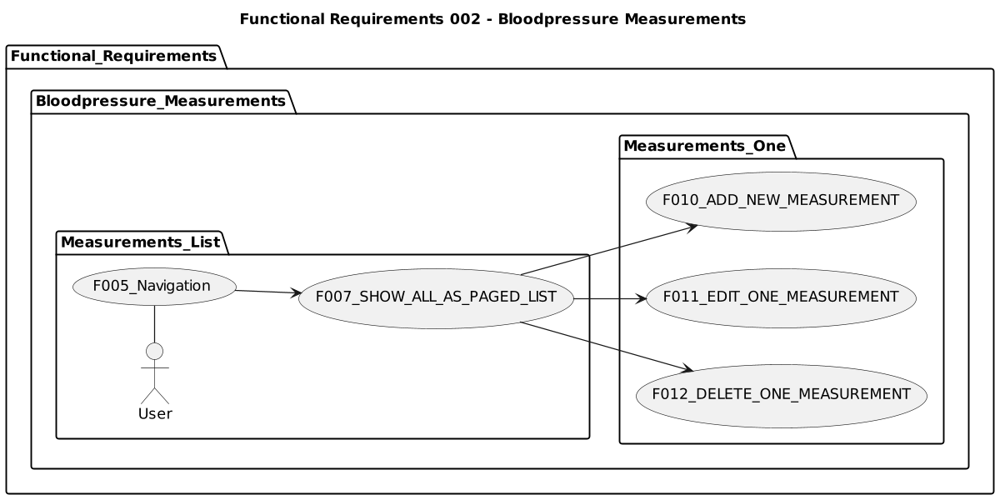
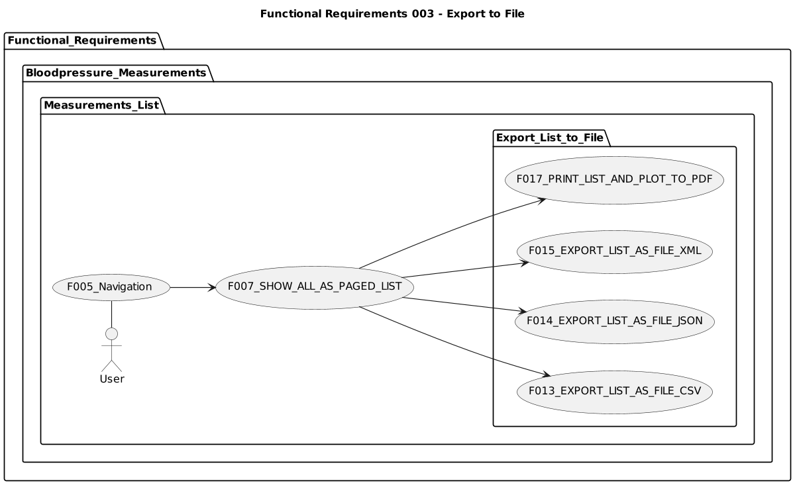
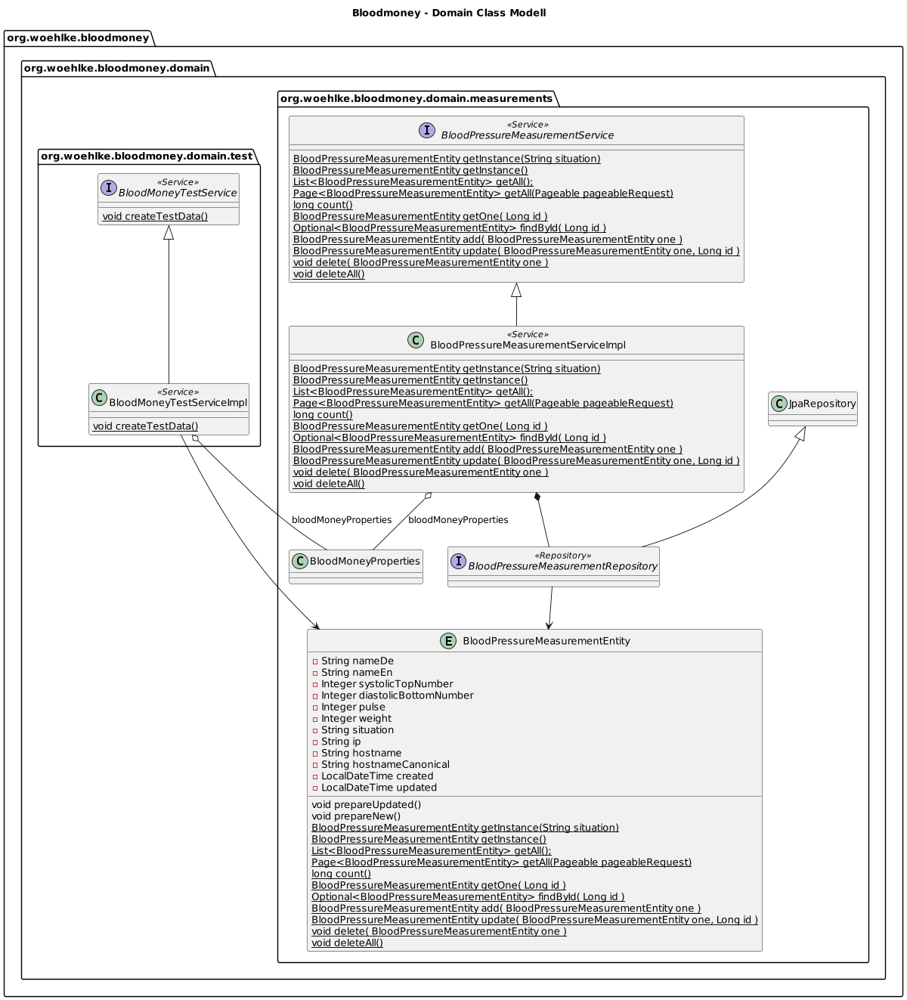
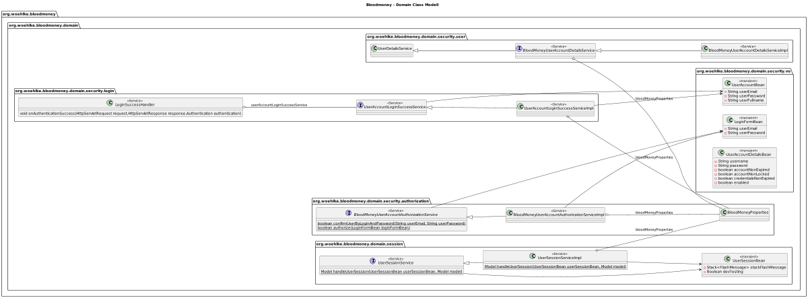
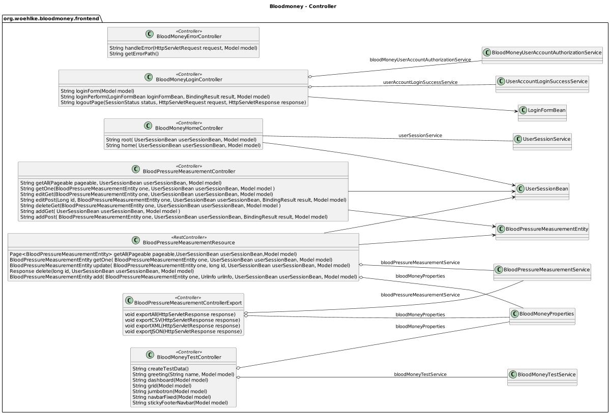
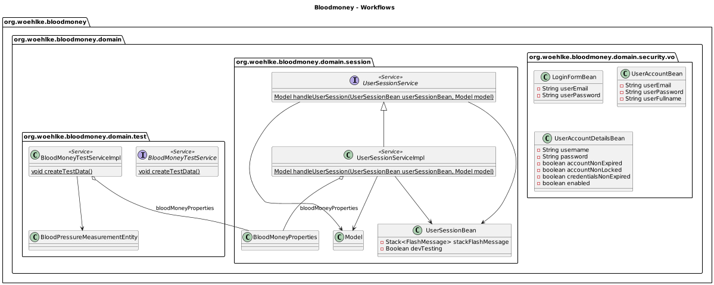
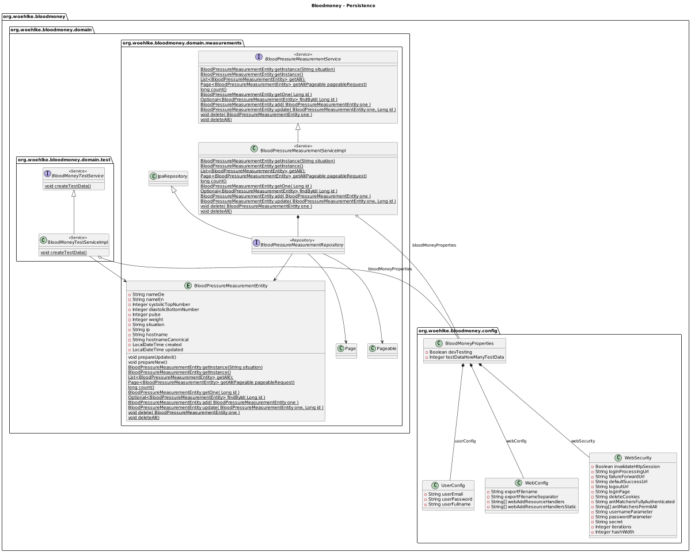

# Bloodmoney

Webapp for storing Blood Pressure Measurements for one Person.

## Deployments
* https://bloodmoney2.herokuapp.com/
* http://localhost:8080/

## github
* [Issues](https://github.com/BloodMoneyApp/bloodmoney/issues)
* [Projects](https://github.com/BloodMoneyApp/bloodmoney/projects)
* [Milestones](https://github.com/BloodMoneyApp/bloodmoney/milestones)
* [Releases](https://github.com/BloodMoneyApp/bloodmoney/releases)

## Development Documents
* [CHANGELOG](CHANGELOG.md)
* [DEPLOYMENTS](DEPLOYMENTS.md)
* [DOCKER](DOCKER.md)
* [HELP](HELP.md)
* [HOWTO](HOWTO.md)
* [TODO](TODO.md)

## Trivia
The Name Bloodmoney was inspired by the Song "bloodmoney" on the 12" Vinyl EP
[The Sisters Of Mercy: No Time To Cry (UK & Europe, Feb 1985)](https://www.discogs.com/The-Sisters-Of-Mercy-No-Time-To-Cry/release/6717124)

## Feature Request Backlog
* Feature #142 CRUD for Measurements
* Feature #141 Very Simple Login
* Feature #140 Frontend: Thmyleaf, Bootstrap
* Feature #138 Deployment om Heroku
* Feature #136 Better Login and User Selfservice
* Feature #135 Soap Webservice with Login and CRUD for Measurements
* Feature #134 Test Client for Soap Webservice
* Feature #133 REST Webservice with Login and CRUD for Measurements
* Feature #132 Test Client for REST Webservice
* Feature #139 Webapp shall send Emails

## Changelog
* [TODO](TODO.md)
* [Changelog](CHANGELOG.md)

## Use Cases
| Use Case                                   | Status | Tested manually | Tested Spring IT | Tested Selenium |
|--------------------------------------------|--------|-----------------|------------------|-----------------|
| F001_Server_Starts                         | OK     | OK              | OK               | OK              |
| F002_Home_Page_rendered                    | OK     | OK              | OK               | OK              |
| F003_Login                                 | OK     | OK              | OK               | OK              |
| F004_Page_after_first_successful_Login     | OK     | OK              | OK               | OK              |
| F005_Navigation                            | OK     | OK              | OK               | OK              |
| F006_Logout                                | OK     | OK              | OK               | OK              |
| F007_SHOW_ALL_AS_PAGED_LIST                | OK     | OK              | OK               | OK              |
| F008_PAGED_LIST__NAVIGATE_THROUGH_PAGES    | OK     | OK              | OK               | OK              |
| F009_PAGED_LIST__SORT                      | OK     | OK              | OK               | OK              |
| F010_ADD_NEW_MEASUREMENT                   | OK     | OK              | OK               | OK              |
| F011_EDIT_ONE_MEASUREMENT                  | OK     | OK              | OK               | OK              |
| F012_DELETE_ONE_MEASUREMENT                | OK     | OK              | OK               | OK              |
| F013_EXPORT_LIST_AS_FILE_CSV               | OK     | OK              | OK               | OK              |
| F014_EXPORT_LIST_AS_FILE_JSON              | OK     | OK              | OK               | OK              |
| F015_EXPORT_LIST_AS_FILE_XML               | OK     | OK              | OK               | OK              |
| F016_PLOT_LIST__AS_FUNCTIONGRAPH_OVER_TIME | Draft  | -               | -                | -               |
| F017_PRINT_LIST_AND_PLOT_TO_PDF            | Draft  | -               | -                | -               |

### Functional Requirements 001 - Start

### Functional Requirements 002 - Bloodpressure Measurements

### Functional Requirements 003 - Paged List

### Functional Requirements 003 - Export to File

## UML Class Diagrams
### Domain Class Modell Data

### Domain Class Modell User

### Controller

### Workflows

### Persistence

